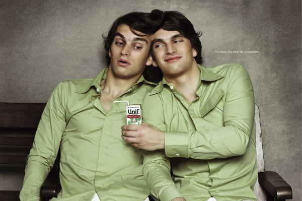
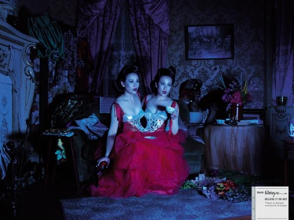
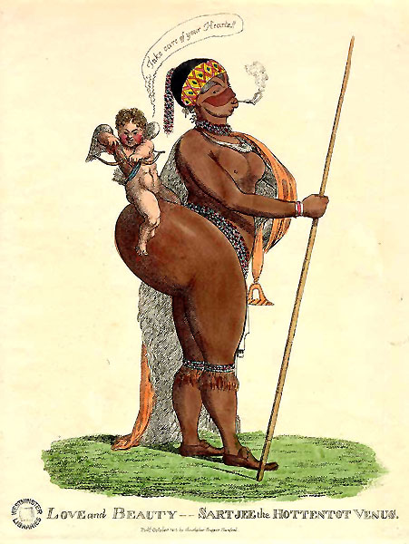
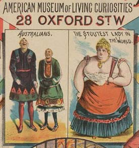

In his essay “On Seeing and Knowing”,
Foucault defines the bodily space and our positioning of the body within
the clinic through different modes of observation. Namely, Foucault
juxtaposes two types of the patient’s perception of otherness (which he
terms gazes): the observing gaze and the hearing gaze. The observing
gaze is in a very submissive position, because it “refrains from
intervening: it is silent and gestureless. Observation leaves things as
they are…” (Foucault 123). This makes me think of how we act in the
presence of doctors. Upon entering the doctor’s office, our beings
descend into a state of hypnosis, and it is our eyes that become more
active than any other part of our body. Our eyes inspect and analyze the
clinical environment, the doctor and his/her movements, and the medical
equipment. I cannot stop but wonder why our bodies become immovable, and
why we are afraid of making any bodily movements.
At this point, I have to agree with Socrates’ statement that humans are
slaves to their own bodies, and that our bodies prevent us from thinking
about anything else but our fears, loves, and desires (see Plato,
*Phaedo*). The more we think we are in control of our bodies, the more
we fear for them. Just like in the outside world, in a clinic, we
observe things that could possibly harm or help our bodies; however,
this perception seems to be more prominent in the presence of a doctor.
In a clinic, our bodies become immovable primarily because we come to the
realization that we are not in control of them, but that they are being
controlled by someone else, either a nurse or a doctor, and worst of
all, by means of equipment. Human beings live with the belief that they
are in possession of their own bodies, and as such, they try to alter,
preserve, or save their bodies from possible disabilities that have been
constructed by their own cultures or societies. **Are we really in
possession of our own bodies, and can we really know our body and its
functions based on what we eat or drink, its weight, and whether we run,
walk, bike, or use a car? After entering the doctor’s office, do we
really fear for our lives or do our fears come from the realization that
our bodies and bodily functions may become considerably altered, in one
way or another?** By observing the clinical environment and its
patients, our bodies see only a fixed image of disease, disorder, and
complete lack of authority and power.

The second type of the patient’s perception, the hearing gaze, plays a
very important role in the construction of the bodily condition. This is
where the influence of language steps in: Do we see what we hear, or do
we hear what we see? For example, if the patient is led into a Radiology
department for a CT or an MRI, s/he will immediately presume that their
body is in grave condition. If their body is tested more than they had
expected, then their fears for the body’s well-being become deeper and
deeper. The doctor’s language and the way s/he formulates his/her speech
play a very important role in the patient’s mind. In the doctor-patient
relationship, language loses its meaning in the sense that the doctor
says one thing and the patient hears something entirely different. It
is in our nature to speculate everything we hear, thus the patient, in
the presence of a doctor speculates everything s/he is told. If the
patient is told that their health is in a good condition, they will most
likely question that. If told that their health is in a bad condition,
they will question that even more to the point that they will require
the doctor’s claim to be sustained by enough evidence. In this moment
between what we hear and what we see, which Foucault calls “clinical
experience” (130), the clinical gaze steps in. As I look at it, “the
clinical gaze” (Foucault) is that final result or a manifestation of our
perception of otherness, of anything that is outside the norms of our
society. The clinical gaze is a projection of our fears to possibly
adapt to a disability, which is reflected in our need to create
institutions for the weak and the sick, such as hospitals, asylums, or
retirement homes—and it is institutions of this type that are direct
products of the clinical gaze.

How did we come to construct the concept of disability as opposed to
normalcy, or *dis-disability*? In his essay “Constructing Normalcy”,
Lennard J. Davis challenges the notions of normalcy and disability by
subverting the concepts of *normalcy* and *norms*. One of the main
issues in the studies of normalcy and disability is that they have been
generally analyzed through a lens of “exnomination” (as pointed out by
Professor Dolmage)—through naming disability, and not naming normalcy.
What is normalcy, and where do our views of normalcy come from? This is
exactly what Davis focuses on: instead of placing a focus on disability,
he focuses on our construction of norms. “We live in a world of norms”
(Davis 23), therefore, we tend to keep up with such norms or with that
which is considered an average. If we are below the average, then we do
not fit in the society, and are extensively disabled. What really
strikes one about Davis’ essay is the fact that words such as “normal”,
“norm”, or “average” did not enter the European languages before the
nineteenth century. What plays a big role in this is the development of
statistics as a science, however, we have to bear in mind that in Europe
the nineteenth century becomes important primarily for the industrial
revolution and its industrial-technological advances. With the
industrial revolution came the class-division among the bourgeois and
the proletariat. **Was disability constructed by the members of the
bourgeois as a type of protective shield, or a form of distancing
oneself from everything that is outside the norm? Was this a part of a
master-plan of the very few (at first) to control the masses, both
financially and politically?** The notion that “to have a disability is
to be an animal, to be part of the Other” (Davis 40) has been working as
a very powerful tool of control and domination over everyone or
everything that is considered below average. In most of today’s
societies, watching TV, using a computer, driving a car, or eating a
drive-thru food is considered the norm. According to this, anyone not
following this is immediately classified below average and as
constituting a social-integration disability. With the arrival of the
industrial revolution and factories, we had the arrival of machines, and
with the arrival of machines came mutilated and injured bodies. Of
course, no member of the bourgeois suffered any means of mutilation or
an injury in factories, since all the hard work was done by the workers.
This is how the process of marginalization began: if the body was
deformed or injured by any means, it would instantly be looked upon as
ugly! Accordingly, the concept of a beautiful, near-ideal body emerged.
Emerging societies and cultures have taught us how to classify that
which is beautiful and normal, and that which is ugly and
abnormal/disabled. In the 1930s and 1940s (as Davis suggests), the Nazis
were sterilizing everyone they considered disabled, and among the
disabilities were: “congenital feeblemindedness, manic depressive
insanity, schizophrenia, hereditary epilepsy, hereditary St. Vitus’
dance, hereditary blindness and deafness, hereditary bodily malformation
and habitual alcoholism” (Davis 38).

In “Seeing the Disabled”, Rosemarie Garland-Thomson connects disability
with race, ethnicity and culture, analyzing the concepts of monstrosity,
freakishness, and physical disability through a visual medium, in this
case photography. Spanning from the representations of disability in
medical photography to the representations of disability in modern-day
ads, Garland-Thomson singles out four different modes or types of visual
rhetoric: the wondrous, the sentimental, the exotic, and the realistic.
As a visual medium, photography can be twofold—it can either disclose
the truth or hide the truth from the viewer(s). **We are told that
photography is worth more than a thousand words, and here is where the
real problems arise. How does one read the coded language of
photography? How do we know if the photographer’s lens were used to
confirm, challenge, or negate certain claims or opinions? Is everything
we see on a photograph the reality that we are unable to see in the
outside world, or is all that the photograph gives us just an
illusion?** In terms of the representations of disability in
photography, photographs can denote both positive and negative meanings,
or as Garland-Thomson suggests, they can communicate “either the ‘truth’
of disability or perpetuate some oppressive stereotype” (339).

I would like to focus on the third mode of visual representation or
visual rhetoric in photography, the rhetoric of the exotic. As remarked
by Garland-Thomson, there is a certain amount of distance between the
viewer and the viewed in the rhetoric of the exotic. Namely, the
person’s disability in the photograph is seeing as something alien,
which is “often sensationalized, eroticized, entertaining” (343) for the
viewer. In the rhetoric of the exotic, the viewer sinks into the
position of a tourist, an attendant of a spectacular play or show,
paying an admission fee to satiate his/her hunger for the exposition of
the bodies that are below the average. At this point, it is worth
mentioning the famous cases of the Hottentot Venus (Sartjie Baartman)
and the Elephant Man, whose bodies were exposed in the
nineteenth-century England for the purpose of pleasing the morbid tastes
of the European bourgeois audience. When I think of the case of Baartman
and the fascination with her breasts and buttocks, I am reminded of
Freud’s views about the inferiority of women and their sexuality. We had
Baartman and other women exposed for their buttocks or breasts in the
nineteenth-century Europe, and if we look at most of today’s societies,
we could say that not much has changed. Women and their sexuality are
viewed as exotic objects by their male counterparts; what is more, the
first thing most men notice about women is their buttocks or breasts,
and perhaps this is why Freud viewed female sexuality as anal.

Picture 1: Looking at this ad for Unif drink, posted on a billboard in
Thailand, I am thinking of how we look at the lives of disabled people,
in this case the siamese twins. The only time I have ever seen siamese
twins was either in a medical book, or on TV. Is it possible that we as
a money-dominated society have forced all of the siamese twins to live
in complete isolation, away from public attention? What I find
particularly fascinating about this ad is that it does not evoke the
feeling of sympathy in viewers, but on the contrary, it positions people
with disabilities within a world that is adjusted to their needs. Even
to this day, a lot of people think of siamese twins as deformed, evoking
feelings of disgust and terror, but this ad destroys that veil of terror
by depicting the twins as normal functioning guys who value life, and
think of life as something filled with charm and beauty (just pay
attention to the whimsical and flirtatious look on their faces). One
thing that bothers me about the ad is the fact that it gives off the
idea of siamese twins favoring the same things, dressing the same,
drinking and eating the same food. While their likes and dislikes might
be similar, science has proven that the tastes of twins, including
siamese twins, can differ extensively.

Picture 2: This clothing ad depicts siamese twins in a very sexualized
way. What is emphasized here is not the disability of these two women,
but their sexual attributes and their feminine beauty. So much emphasis
is put on their faces, rather than their bodies. In the eighteenth and
nineteenth centuries, siamese twins were looked upon as freaks who
evoked feelings of awe, wonder, and fear. There existed an ideal of a
perfect, tamed, and civilized Victorian woman whose physiognomy and
disposition had to reflect the woman’s skills and virtues. If we look at
this photograph closely, the women are placed in a Victorian-like
setting (pay attention to the decorations on the wall, the curtains, the
furniture, even the tea cup one of the twins is holding in her hand),
but their dresses are very modern. Dressed in red, elegant dresses, both
women are seated in a very elegant manner. Looking as if they are headed
to the ball, or have just returned from one, we get the image of two
disabled bodies which are engaged in regular everyday activities that we
generally conceive of as being reserved for non-disabled people.

Picture 3: The Image of Sartjie (Sarah) Baartman, one of the most famous
human exhibits at freak shows in the the nineteenth-century England and
France. The other day in the class on gender in postcolonial literature,
we watched the movie Blu in You, directed, written and produced by
African Canadian artist Michelle Mohabeer. Ever since that class I have
been thinking about how we come to construct things from the past,
especially if a considerable portion of that past has been hidden from
us. Looking at how the descendants of the colonized people are
struggling to reclaim their ancestry and legacy, and the non-altered
history of their own peoples and their own lands, I have been wondering
how the postcolonial mind breaks away from the colonizer's history,
dissecting and shattering its largely fabricated facts that have become
deeply ingrained in the minds of the majority of world’s population.
Reflecting back on the images and symbols presented in the movie, I was
reminded of Slavoj Žižek, who in his interpretation of Lacan’s
mirror-stage, claims that “The Imaginary balance changes into a
symbolically structured network through a shock of the Real” (Everything
You Wanted to Know About Lacan but Were Afraid to Ask Hitchcock,p.3).
Professor Smyth asked about the video the woman is watching throughout
the movie, and it made me think a lot about that particular scene after
Wednesday’s class. If we consider the above mentioned statement by
Žižek, the woman in the movie is trying to imagine the past of Sartjie
Baartman, and it is then through the workings of the imagination that
Baartman’s past becomes reflected into symbolism, “a symbolically
structured network” of the rope transforming itself into a female reproductive organ, and a
tool for mutilation. These images exert a very powerful effect on us as
the audience, because they create the shock of the Real in our minds—the
shock of Reality. This Reality is not that Sartjie Baartman was a freak
and nothing else but a freak, but that she was a woman, someone’s
daughter, sister, a human being who was stripped of honourable death,
because she died as a freak--not because she was considered to be one,
but because her body and her womanhood were brutally mutilated and
exposed as commodities that would cater to the morbid tastes of humans
for almost two hundred years more after her death.

Picture 4: Poster for a freak show in the United States.

Picture 5: Perception is a curious thing, determining how we position
ourselves in contrast to others and the world as a microcosm of the
universe. Looking at this photograph makes me wonder about one thing:
Aren’t we all just small, minute creations under the skies of the vast
universe?
