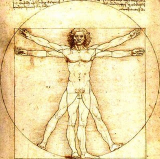

> *There is more wisdom in your body than in your deepest philosophy!*
> Friedrich Nietzsche

Societies, communities, and groups are
usually based on the principles of obedience, respect, honor, and
tolerance; however, instead of being applied to every individual in a
respective environment, these principles became subverted into state
enforced norms, laws, and rules, which ostracize anyone not conforming
to “normative” or “proper” social, physical, cognitive, or economic
abilities. As a result, we have reached the point where people follow
that which does not necessarily bring good to the majority or create the
functioning system, but that which benefits only those who devise the
rules. For the great part of our lives, we carry the desire for
belonging—belonging to a family, group, community, work environment, or
society at large—which manifests itself in the desire to be accepted
and materialized. This desire would never be so starkly present if it
was not for the stratifications societies create. Not only do societies
stratify its members based on their economic and/or social accomplishments,
but also based on the physical construct(s) of one’s body and the abilities
that body can perform. Just because the majority of the state’s
population can perform certain activities with their bodies, any
individual unable to perform such activities in the same or similar way
is immediately viewed as disabled. 

*****
Why is disability assigned to *particular* bodies? In societies with thousands or millions of people,
the particularities of bodies seem unnoticable and irrelevant, but when
placed in a smaller community or group, the particularities of bodies
become starkly visible and surprisingly of great relevance. Aren’t all
bodies particular and unique in their own way? The same bodily parts
differ in different people, for example my toes may be bigger than my
friends’, or my friends may have bigger hands than me. Today, more than
ever, we use our bodies to shape our identities, our sense of
belonging, our fears, desires, and frustrations, but most importantly,
we use our bodies to voice that which we cannot/are not permitted to
voice through language. Whether we are able-bodied or disabled, we use
our bodies as a material or platform for the portrayal of symbols. We
all partake in this portrayal, either through what we wear or eat and
drink, or through our bodily actions, and some of us do it in more
physically expressive ways, such as body piercing or body art. In light
of this, I would not necessarily say that disability is a material
located in particular bodies, but that we all inhabit bodies that may
potentially become excluded by a group as a whole or the group members.
Disability and disabled bodies can work as a highly constructive and
educational social force, which makes us perceive bodies from a new
persepective, shatters bodily *norms*, and makes us face and question
that which we think of as uncomfortable, undesirable, unintelligible.

*****
Ever since Professor Dolmage posed a question about the type of lexicon
that shapes rhetorics, bodily rhetorics in particular, I have been
thinking about whether sign language could shape and define rhetorics.
How does sign language define a lexicon of the standard use of language?
A great majority of humans think in terms of symbols and images, which
are then expressed through language. The languges we speak and write
have become extensively modified in the course of centuries, and most of them
have lost the symbolic represenation of letters that they once used to
possess. This happened even to the current *lingua franca*, the modern
English language, which was created through an adoption of words from
various Indo-European languages (primarily Latin), and through the
exclusion of a great part of the Old and Middle English lexicon where
letters, apart from representing a particular phoneme, were written as specific symbols. 
How have we come to replace symbols with words, either spoken or written? 
Sign language is the language of symbols, with its own grammar, syntax, morphology, and vocabulary. 
It is probably the most symbolic language that has survived—even Chinese
language is starting to lose its symbolic representation of alphabet.
Isn’t sign language the archetypal use of language, and why can’t sign
language be a primal definition of rhetorics? The first human
communities and societies were communicating mainly through the use of
symbols, with each community developing its own symbolism. Despite the
fact that the majority of world’s population communicates through
spoken mediums, we still interpret and analyze dreams or
experiences through different symbols.
