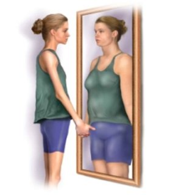

Zhuangzi, a follower of Daoism, once
described his “Butterfly Dream” in a highly illustrative way, noting:
“Once upon a time, I, Chuang Chou, dreamt I was a butterfly, fluttering
hither and thither, to all intents and purposes a butterfly. I was
conscious only of my happiness as a butterfly, unaware I was Chou. Soon
I awaked, and there I was, veritably myself again. Now I do not know
whether I was then a man dreaming I was a butterfly, or whether I am now
a butterfly, dreaming I am a man. Between a man and a butterfly there is
necessarily a distinction. The transition is called the transformation
of material things” (*The Book of Zhuangzi*). What if we are all
*butterflies* dreaming we are men in an age we have come to call
postmodernism? What if our bodies transform every second of our
existence; what if we are all re-born in a new historical period, and
what if we still carry the same body—and the only things that make our
bodies appear different are the changing garment and
industrial-technological objects? Or perhaps not. What if our bodies
really do transform from one type of butterfly to another; what if they
become different in color, form, gender, shape, size, substance, weight,
depending in which age our bodies proceed? But how do we position our
bodily existence in an age that we can't even define properly? Are our
bodies now confined to modernism or postmodernism? 

*****
In their article “Mapping the Terrain”, Mairian Corker and Tom Shakespeare have outlined
some of the prevalent opinions and theories that define modernity and
postmodernity, but their primary focus is aimed at the ways in
which postmodernist, and along with it, post-structuralist theories can
influence our perception and approach to disability studies. Corker and
Shakespeare point to the fact that we now live in the “age of
uncertainty” (1) where we have come to negate the sacred, the meaning,
the human, the existence of almost everything, and where the way we
speak and think needs to be replaced with a “new language, new theories
and new forms of practice” (1). While I do heed the idea that we live in
the age of uncertainty, I also believe that, despite the age—whether we
are talking about three thousand years ago, a hundred years ago, or
now—humans have always lived in the age of uncertainty, simply because
humans themselves are uncertain about everything and tend to question
everything they experience. Moreover, every age had some ground-breaking
changes, which considerably influenced the workings of our bodies and
minds. I like to entertain the thought that we now live in what Steven
Heighton calls “the Age of Clowns” (*The Admen Move on Lhasa*, 42),
where we think of machines as more valuable and sacred than humans (more
money is invested in the production of androids, cell phones and video
games than in the development of safe drinking water systems for
everyone in the world), where the real cannot be differentiated from
its fabrication (everything is a copy of the copy), where books are being
replaced with virtual books that can be accessed only if you own a
technological device, where people are infatuated with the superficial
and trivial (more money is invested in curing baldness than curing
cancer), and where communication has lost any meaning, simply because
langauge became transformed into a “parroting language”, invaded by
words such as “like”, “sort of/kind of”, “actually”, “I mean”, and so
on—it is interesting how we have come to devalue silence and pauses in
each other's communication. 

*****
Not only have we become the puppets of economic, political and social systems, but we have also evolved into clowns, and instead of trying to change the systems and preserve the
human values, we simply joggle between the material, the fake, and the
superficial, choosing one or the other, or everything combined. I find
it interesting how Corker and Shakespeare define modernism or modernity
through the Enlightenment and capitalism, in which “the individual is
seen as the creative force of society and history” (2) and where
everything is reduced to “the superiority of the West, the idea of
science as Truth and the belief in social progress” (2). When it comes
to disability studies, modernism has paved the way for individual and
medical models of disability, which define disability as deviant and
inferior to normal bodies, with normal bodies being defined through the
functioning of certain cognitive and physical attributes. One of the
challenges to modernism’s classification of disability was a social
model of disability, or the idea that disability, rather than being a
medical construct, is actually a social construct. When it comes to both
modernism and postmodernism, not only are we classified by our age,
gender, ethnicity or religion, but also by the the amount of money we
have. In capitalist societies, having no money or small amount of money
equals disability. At one point, Corker and Shakespeare engage in an
interesting discussion about Baudrillard’s *theory of representation*
and the *ideology of disembodiment*, which imply that postmodernism has
completely disrupted our sense of identity an belonging, as well as that
“social order is code-oriented, and power is conceptualized in terms of
cybernetic control” (6). Thus, everything we experience is
transitory—everything is what Baudrillard calls a mere “spectacle”, and
like gender, “Baudrillard would view disability as a *simulation*, and
would therefore refuse the fetishization of people with impairments”
(6). 

*****
This makes me think of the movie *The Matrix*, in particular the
scene in which Keanu Reeves is offered a choice between the blue and the
red pills. Reeves voices a typical postmodernist statement: “I don’t have
a faith, because I do not like the idea that I have no control over my
life.” Through this statement, Reeves confirms Plato’s idea that humans
do not have control over their own bodies, and are therefore slaves to their
bodily fears and desires. *The Matrix* reflectes Baudrillard’s ideas at
its best, representing human bodies as *simulations* manouvered
by the people around us, as well as economic, medical, political, and
religious institutions. The choice between the blue and the red pill can
be seen as the choice between postmodernism and tradition, between
denial and truth, between the search for meaning and its denial. If we
are encapsulated in the global meta-narrative of the denial of truth and
meaning, then how can we apply (if at all) typical postmodernist
theories to our bodies, since with the denial of truth also comes the
denial of bodies and their existence?

In her article “Critically Queer”, Judith Butler poses very interesting
questions about the reclamation of the term *queer* in the LGBT
communities, stating: “When and how does a term like *queer* become
subject to an affirmative resignification for some when a term like
*nigger*, despite some recent efforts at reclamation, appears capable of
only reinscribing its pain? (223)… How is it that those who are abjected
come to make their claim through and against the discourses that have
sought their repudiation?” (224). How come that the term that once was
derogatory and was associated solely with pathological conditions became
a widely accepted word of pride and motivation among the LGBT people?
But as much as the term *queer* may include members of LGBT communities,
it also excludes those same members at the same time. The reason for
this is that the term *queer* is being used for different reasons among
the LGBT people. As Butler elaborates: “in some contexts, the term
appeals to a younger generation who want to resist the more
institutionalized and reformist politics sometimes signified by ‘lesbian
and gay’; in some contexts, sometimes the same, it has marked a
predominantly white movement that has not fully addressed the way in
which *queer* plays—or fails to play—within non-white communities; and
whereas in some instances it has mobilized a lesbian activism, in others
the term represents a false unity of women and men” (Butler 228). Just
as it is “necessary to lay claim to ‘queer,’ ‘gay,’ and ‘lesbian’
(simply because these terms lay their claim on us prior to our full
knowing)” (Butler 229), it is also necessary for the disabled people
born with a physical or cognitive disability to lay claim on terms such
as “crip”, “handicapped”, etc., which ties back into the discussion on
acceptable and non-acceptable terms for disabled people, which is what
Simi Linton tackles in “Reassigning Meaning”.

1.  If gender is performative (Butler refers to gender-as-drag where
    gender is mimed or impersonated), does this mean that disability can
    also be performative?
2.  Is there a difference between the performing of able-bodied norms
    and “the performative use of discourse” (Butler 231)? How can a
    disabled body resist/supress the laws of disabling societies?
3.  Here is an interesting article written by Philip Patston, a
    disabled, gay Australian comedian who oftentimes combines disability
    and gender-as-drag in his acts. The article was published on the
    site of the New Zealand’s creative community [The Big
    Idea](http://www.thebigidea.co.nz/news/blogs/the-creative-collide/56711-when-drag-and-disability-collide-revisited).
    
*****
I find Susan Bordo’s examination of eating disorders—anorexia and
bulimia—particularly interesting, because she puts in a very feminist
approach accompanied by a psychological perspective. I have always
thought of anorexia and bulimia as disabilities; however, these are not
physical disabilities per se. Anorexia and bulimia are perfect examples
of how patriarchal and capitalist societies create ideals of beauty and
perfection. But are these societies the only ones that are to be blamed
for this? Is one of the illnesses of the modern age, predominant among
women, really imposed by the patriarchy? Bordo refers to Susie Orbach’s
argument that mothers whose daughters suffer from eating disorders are
not to blame, “for they too are children of their culture, deeply
anxious over their own appetites and appearance and aware of the
fact—communicated in a multitude of ways throughout our culture—that
their daughters’ ability to ‘catch a man’ will depend largely on
physical appearance, and that satisfaction in the role of wife and
mother will hinge on learning to feed others rather than the
self—metaphorically and literally” (Bordo 47). An argument like this
might have been partially correct in the 1980s, but not anymore. A lot
of mothers are to be blamed—just look at the extremely popular American
TV shows featuring five or six-year-old girls whose mothers are like
“beauty pimps”, teaching their daughters everything about make up, sex,
and swear words before even teaching them how to read or write. On top
of everything, the girls’ bodies are transformed into very sexualized
bodies, shaped by not what the girls want to eat but what their mothers
tell them to eat. Now imagine what kind of eating problems and
inferiority complexes these girls will have once they grow up. Another
example is the TV show *The Next Top Model*, now popular in almost every
Western country. Shows of this kind dictate the laws and norms of beauty
and bodily perfection, and as a result, we may come to the point where
being non-anorexic or non-bulimic will be looked upon as a pathological
condition. One of the common disorders in people suffering from anorexia
and bulimia is what doctors have termed as Body Image Distortion
Syndrome (BIDS) or Body Dysmorphic Disorder in which the person fails to
see the realistic image of their body. The latest medical research has
proved that people with BIDS have problems in processing the visual
input, and that a lot of them suffer from anxiety and depression.

