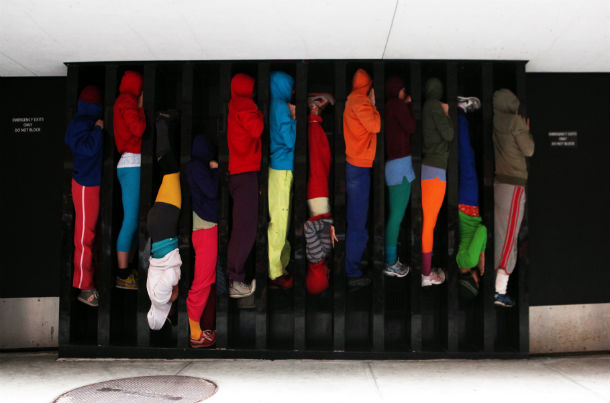
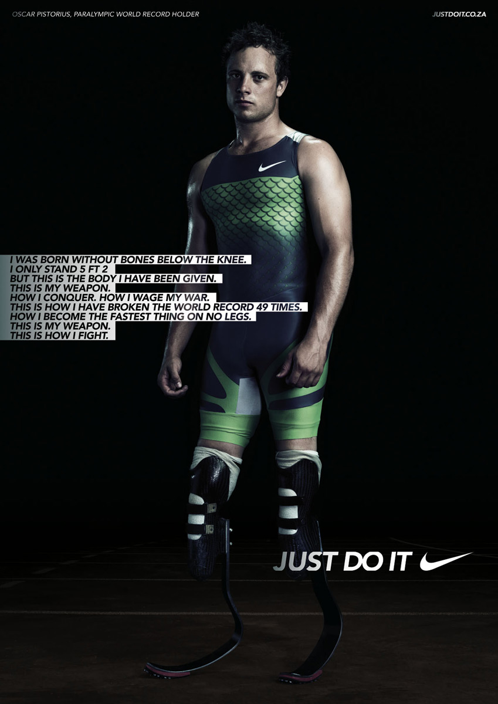

> *You’re not disabled by the disabilities you have, you are able by the
> abilities you have.* —Oscar Pistorius

Reflecting on numerous disability studies
theories that we have covered in the course so far, Tobin Siebers
attempts to define bodies and bodily idenitities as positioned within
the social and political environment. I find it particularly interesting
how Siebers juxtaposes identities defined through race or gender, and
identities defined through a disability. As his definition clearly
denotes, “It is true that some individual bodies are black, female, or
both, but the social meaning of these words does not account for
every­thing that these bodies are. Rather, these words denote large
social cate­gories having an interpretation, history, and politics well
beyond the par­ticularities of one human body. This fact is, of course,
largely recognized, which is why the attempt to reduce a given body to
one of these terms car­ries the pejorative label of *racist* or *sexist*
(Siebers, *Disability Theory: Corporealities Discourses of Disability*,
80). When it comes to defining a body through ability/disability, that
is a completely different story. If a person is in a wheelchair, or if
they are deaf, then their body is defined by nothing else but their
inability to move or hear. As a result,” disability does not yet have
the advantage of a political interpretation because the ideology of
ability remains largely unquestioned "(Siebers 81). In the age when
humans are exposed to more danger and more accidents, and where our
bodies are becoming more susceptible to different illnesses, *how can we
define ability*? *What lexicon defines and determines ability*? *Is an
ability that which is opposite from a disability*? Siebers opens up a
completely new persepctive, stating that disability is defined by a
social and built environment, rather than by medical terminology or
society itself. When I think about it, the way houses, buildings,
restaurants, cafés, shopping malls are designed—in general, the way
society designs spaces—is very delimiting to people with disabilities.
The society favours only one form or aspect of the human body, and due
to that, it defines the characteristics of one’s social body. ‘This
social body determines the form of public and private buildings alike,
exposing the truth that there are in fact no private bodies, only public
ones, registered in the blueprints of architectural space’” (Siebers
85).

1.  If there are no private bodies, as Siebers claims, then can we
    really be “slaves of our own bodies” (heeding Hegel’s and Socrates’
    definition), or are we simply slaves of social spaces constructed by
    human bodies?
2.  Can public spaces be disabled. i.e can their disabling functions
    become limited?

Picture 1: “Bodies in Urban Spaces”, a performance designed by an art
director Will Dorner, who is interested in the ways bodies can be used
to fill empty spaces, in particular empty urban spaces. What makes this
performance particularly interesting is that it does not only include
professional dancers and performers. Passers-by also volunteer to take
part in this act.

Picture 2: A South-African runner Oscar Pistorius in a commercial for
Nike.

In the the final chapter of his book *Crip Theory*, Robert McRuer places
his focus on the location of bodies in a global world, and on a world as
inhabited by global bodies. If disability studies has gone global, the
question is whether that “gloability” pertains solely to the United
States, Canada, and most of Europe, or whether it also addresses the
rights of disabled people in Third World countries? Interestingly, we do
not seem to hear much about disability rights movements and disability
rights activists in such countries, partially because the media mainly
broadcasts the negative aspects of Third World societies, and even if
there are any positive things happening in the development of disability
rights activism, we cannot know that. If we look at global bodies as
constructs that “inhabit and move between global cities” (McRuer 203),
then most individuals in Western or Westernized societies possess global
bodies indeed. Some of us travel between cities for work; international
students travel between their home city and the city in which they live
during their studies; people involved in long-distance relationships
travel between one city to another to see their partner. However, McRuer
also implies that global bodies may not necessarily refer to humans. On
the contrary, “twentieth-century modernity established *global bodies*
such as the League of Nations and the United Nations; the age of Empire
has privileged more diffuse *global bodies* such as the World Bank, the
International Monetary Fund, and—of course—multinational corporations”
(203). Tangible, human bodies have become dependent on financial and
multinational corporations to such an extent that the possibility of
nurturing, moving, or improving our bodies depends on our ability to
afford and use the products of these corporations. We are now trapped in
the age when our bodies have turned into what Grace Chang calls
“disposable domestics” (referenced in McRuer, 203). I really like how
McRuer highlights the fact that the financial coprorations have
contributed to creating a predominantly female, migrnat workforce, which
can be seen in the cases of many big corporations, such as McDonald’s,
Wal-Mart, Benetton, Adidas, Nike, and so on. McRuer gives an example of
Wal-Mart, which oftentimes uses people with disabilities in their
commercials, but in reality they do not want to hire anyone who does not
fit within their image of an able-bodied person. This made me think of
Nike, and the ways they are promoting their products in commercials.
Just like in Wal-Mart’s commercials, it is not uncommon to see people
with disabilities in the commercials for the Nike company. Nike, no
doubt, has very inspiring commercials with strong messages of
encouragement and motivation for its viewers, from both able-bodied and
disabled communities. Some of the messages we get in the commercials
are: “My body is my weapon… This is how I defeat my enemies, how I make
victory mine.”, “I’ve got soul but I’m not a soldier”, or “I don’t want
to be a superstar… I don’t collect the titles, I collect hours of hard
work and pain… I don’t want to be a superstar. I want to be better than
that—I just want to be me!” What we can discern from these messages is
that they are directed at the human body and its possibilities, the
strength of mind, and the ability to win stereotypes over what one’s
body is capable of. Unfortunately, in the world outside the commercials,
the Nike company operates in a completely different manner, by
exploiting female workers, children, and disabled people for crafting
the shoes and other clothing items. And on top of that, these workers
are people from Third World countries, working in sweat shops in China,
Vietnam, or Indonesia and getting less than a dollar a day for the
incredible amount of work. The Nike company, just like Wal-Mart, does
not have any disabled persons hired in their main offices in the United
States or Europe; however, commercials made in the spirit of equality,
tolerance and motivation reach a vast number of their viewers, resulting
in hundreds of millions of income for *Nike* every year.

The Nike commercials referenced above {#unnumbered-2}
-------------------------------------
